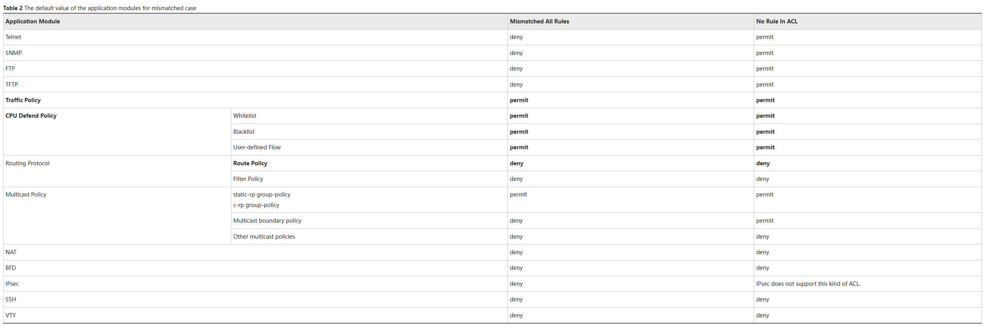

# Основные принципы работы ACL на устройствах Huawei

## 1. Принципы сопоставления ACL

### Что значит "Matched" (Совпало)?
**Matched** означает, что ACL существует, и пакет соответствует хотя бы одному из правил в списке, независимо от того, разрешает ли правило (permit) или запрещает (deny) пакет.

### Что значит "Mismatched" (Не совпало)?
**Mismatched** означает, что:
- ACL не существует.
- В ACL нет правил.
- Пакет не соответствует ни одному из правил в ACL.

## 2. Порядок сопоставления правил ACL

### Проверка наличия ACL:
- Сначала устройство проверяет, существует ли указанный ACL.

### Сопоставление пакетов с правилами:
- Пакеты проверяются по порядку с учетом Rule ID. Это уникальные идентификаторы, которые задаются при создании правила. Когда пакет совпадает с правилом, то дальше проверка не продолжается.
- Все правила в ACL сортируются по возрастанию ID правил, независимо от порядка их конфигурации.

### Идентификатор правила (Rule ID):
- Rule ID задается пользователем или автоматически генерируется системой с учетом ACL increment (шаг инкремента). Например, если шаг инкремента равен 5, то Rule IDs будут 5, 10, 15, и так далее.
- Если пользователь не указывает Rule ID, система генерирует его автоматически.

### Автоматическое распределение ID (Auto Mode):
- Если используется режим автоматического распределения, правила будут автоматически упорядочены по степени специфичности. Это значит, что более узкие правила (например, для конкретных хостов) будут расположены раньше более общих.
- В автоматическом режиме правила с меньшими масками (большей специфичностью) будут помещены выше, чтобы их приоритет был выше.

### Конфигурационный режим (Configuration Mode):
- В этом режиме ID правил задаются вручную. Это позволяет точно управлять порядком размещения правил, что важно для управления приоритетами.

### Глубинный принцип (Depth-First Principle):
- В auto mode правила с более узкими диапазонами (например, конкретные IP-адреса или порты) будут иметь более высокий приоритет. Это помогает администратору создавать правила, не заботясь о порядке их расположения, поскольку система сама обеспечит правильный порядок.

## 3. Применение ACL в разных типах конфигураций

### Basic ACL:
- В Basic ACL правила сопоставляются сначала по VPN-инстанциям (если они есть), затем по диапазону исходных IP-адресов. Если диапазоны одинаковы, то проверяются другие параметры.

### Advanced ACL:
- В Advanced ACL порядок проверки такой же, как в Basic ACL, но также добавляется сравнение протоколов и портов. Это дает больше гибкости при создании более сложных фильтров.

### Layer 2 ACL:
- В Layer 2 ACL правила проверяются сначала по более узким диапазонам MAC-адресов, затем по VLAN ID, а также по приоритетам 802.1p.

### User ACL (UCL):
- В User ACL правила сначала проверяются по протоколу, затем по исходным и целевым IP-адресам, и, если все совпадает, по диапазонам портов.

### MPLS-based ACL:
- Для MPLS-based ACL существует ограничение — правила можно задавать только в Configuration Mode.

## 4. Что происходит, если пакет не совпадает с правилами ACL?

Когда пакет не совпадает с правилами ACL, это называется **Mismatched**. Поведение устройства в этом случае зависит от того, куда применяются эти ACL. Например:

- Для **Traffic Policy**: Если правило не совпало, результат по умолчанию будет **permit**, то есть трафик продолжит проходить.
- Для **Route Policy**: В случае **mismatched ACL** маршрутизация может быть заблокирована, если это прописано в политике.

## 5. Пример работы ACL

### Пример конфигурации ACL:
```bash
acl 3000
 rule 5 deny ip dscp 30 destination 1.1.0.0 0.0.255.255
 rule 10 permit ip dscp 30 destination 1.1.1.0 0.0.0.255


Если в Configuration Mode использован такой порядок, то пакеты с DSCP 30 и адресом назначения 1.1.0.0/16 будут заблокированы, а пакеты с адресом 1.1.1.0/24 — разрешены.

Если используется Auto Mode, то эти правила могут быть переставлены, и правила с более узким диапазоном будут располагаться выше, что приведет к другому результату.

6. Типы действий в правилах
permit — разрешеет пакет.
deny — запрещает пакет.
7. Резюме принципов работы ACL:
Порядок сопоставления правил важен. Устройство проверяет правила по ID.
Ранее правило с более узкой маской будет иметь приоритет в auto mode.
Mismatched означает, что нет совпадений с правилами в ACL.
Стандартные действия permit или deny будут выполняться в зависимости от совпадений.



