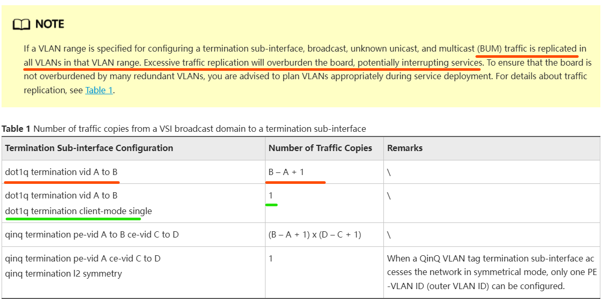

при отправке BUM пакетов в данном VSI они будут реплицироваться во все влан данного сабинтерфейса(где dot1q termination vid XXX to YYY).

Главный вывод:
Если у тебя саб-интерфейс:

interface GigabitEthernet7/1/9.15030
 dot1q termination vid 1300
 dot1q termination vid 2000 to 3710
 dot1q termination vid 3712

и ты не используешь client-mode single или аналогичную сегментацию, то:

Broadcast от VSI (например, ARP от другого PE) придёт на этот саб-интерфейс

И будет сгенерировано 1 копия на каждый VLAN (в твоём случае — много).
