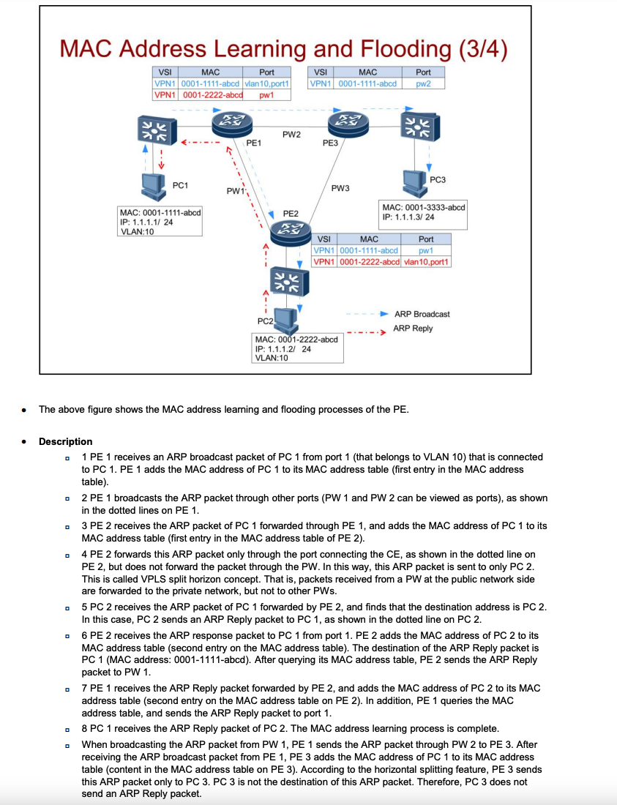

Обычный коммутатор:

Если приходит broadcast-пакет (например, ARP), он рассылает его во все порты, принадлежащие тому же VLAN.

VPLS (с split horizon):

Если broadcast-пакет приходит с PW (псевдопровода, т.е. от другого PE), он не рассылается обратно на другие PW.

Вместо этого пакет отправляется только на AC-порты (клиентские порты, подключённые к CE).

## 1. Режимы изучения MAC-адресов:
- **Qualified Mode (с учётом VLAN):**
  - MAC-адрес запоминается вместе с VLAN (`MAC + VLAN`).
  - Для каждого VLAN — своя таблица MAC.
  - **Плюс:** Изоляция трафика между VLAN.
  - **Минус:** Больше нагрузки на память.

- **Unqualified Mode (без учёта VLAN):**
  - Запоминается только MAC-адрес.
  - Все VLAN в одном VPLS используют общую таблицу MAC.
  - **Плюс:** Экономия ресурсов.
  - **Минус:** Нет изоляции VLAN.

---

## 2. Инкапсуляция пакетов:
- **На AC (клиентский порт):**
  - **VLAN access (по умолчанию):**
    - Пакеты от CE содержат VLAN-тег (**P-TAG**), который идентифицирует клиента в сети провайдера.
  - **Ethernet access:**
    - Пакеты без P-TAG (если есть VLAN, это **U-TAG**, внутренний тег клиента).

- **На PW (псевдопровод):**
  - **Raw Mode:**
    - P-TAG удаляется, пакет инкапсулируется в два MPLS-тега.
  - **Tagged Mode (по умолчанию):**
    - P-TAG сохраняется, добавляются два MPLS-тега. Если P-TAG отсутствует, добавляется "пустой" тег.

---

## 3. Горизонтальное разделение (Split Horizon):
- Broadcast-пакеты, пришедшие через PW, **не отправляются обратно на другие PW**.
- Рассылаются только на **AC-порты** (клиентские порты).
- **Цель:** Предотвращение петель трафика.

---

## Настройки по умолчанию в VPLS (Huawei VRP):
1. **Режим изучения MAC-адресов:**
   - **Unqualified Mode** (если не настроен Qualified Mode).
   - Все VLAN в VPLS используют общую таблицу MAC.

2. **Инкапсуляция:**
   - **AC-порты:** VLAN access (P-TAG используется).
   - **PW:** Tagged Mode (P-TAG сохраняется).

3. **Split Horizon:** Включён. Broadcast-пакеты с PW не пересылаются на другие PW.

---

## Итог:
- По умолчанию VPLS на Huawei:
  - Использует **Unqualified Mode** для MAC-адресов (общая таблица).
  - **VLAN access** на клиентских портах (P-TAG).
  - **Tagged Mode** на PW (сохранение P-TAG).
  - **Split Horizon** активен для предотвращения петель.

Если нужно изолировать VLAN или оптимизировать инкапсуляцию — настройки меняются вручную.

Если нужно изолировать трафик между клиентами с разными SVLAN, Unqualify Mode не подходит.

Например, если у вас есть клиенты из разных компаний, которые не должны видеть друг друга.

