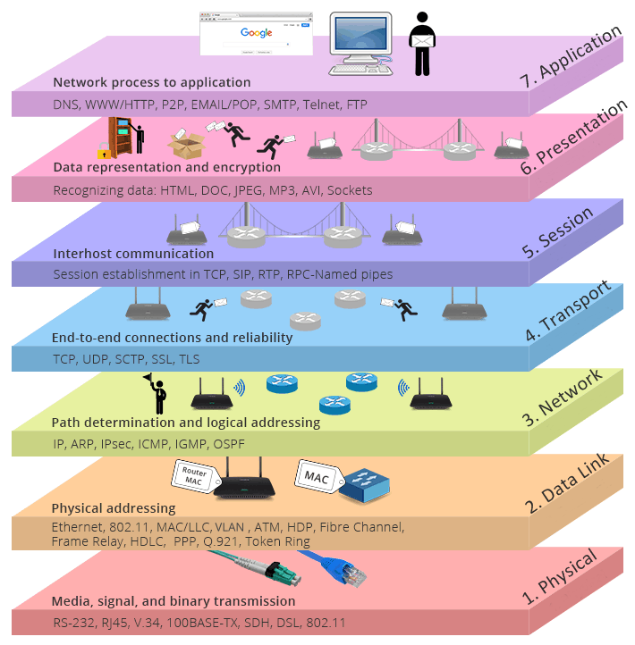
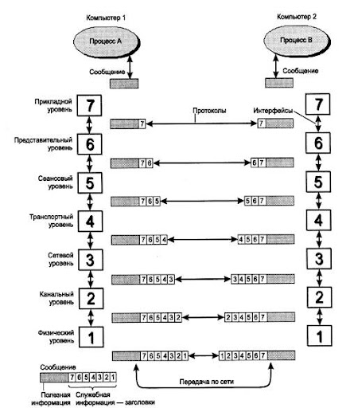

Полноценная QoS-модель работает в несколько этапов:

Классификация и маркировка — какие пакеты важные, какие можно дропать.

Ограничение (полисинг) и шейпинг — чтобы трафик не превышал лимит.

Буферизация (CBS/PBS) — чтобы пережить краткие всплески.

Планирование (queuing) — кто в приоритете.

Управление перегрузками (WRED) — не доводим до красной зоны, заранее сбрасываем "менее важное".