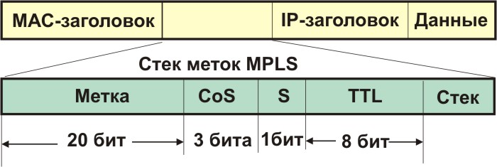
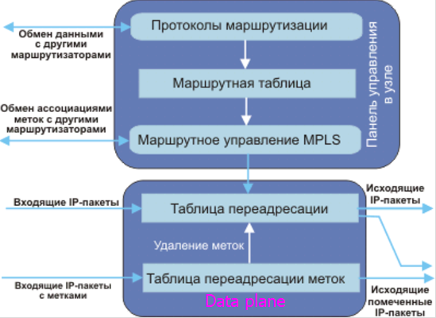
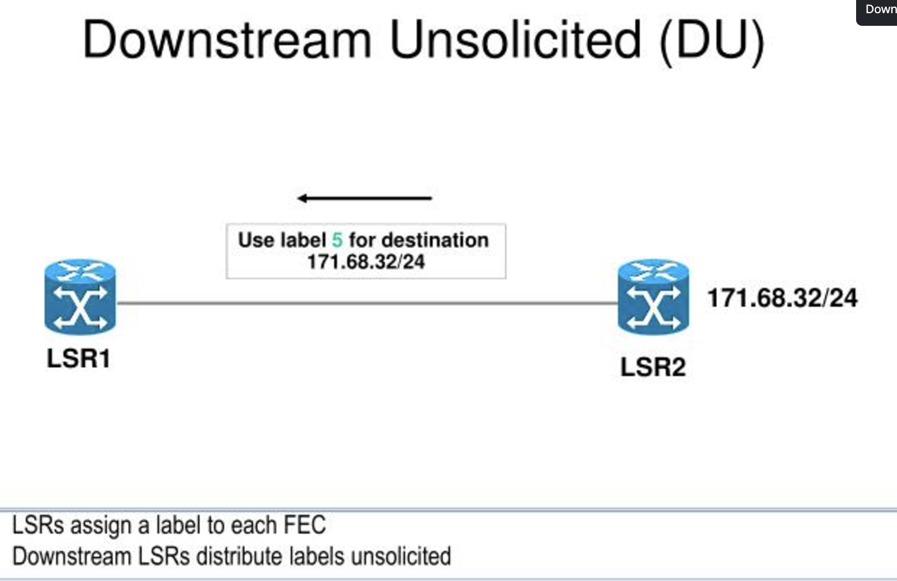
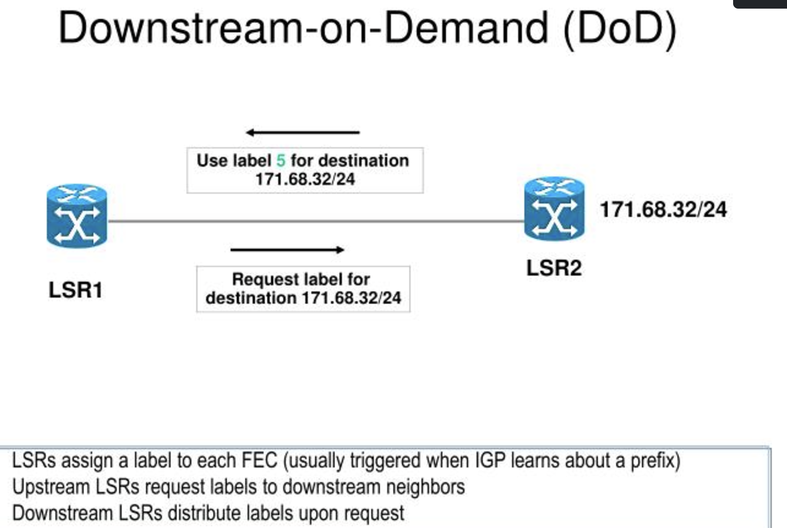

 
 
**Именно идея сохранения в маршрутной таблице только реально используемых виртуальных путей и легла в основу разработки протокола MPLS и сопряженных с ним протоколов маршрутизации.**

# Предпосылки MPLS 

Выбирая следующий шаг на основании IP пакета можно выполнять две процедуры. Первая делит весь набор пакетов на классы FEC (Forwarding Equivalence Classes). Вторая ставит в соответствие каждому FEC следующий шаг маршрута. В той части, которая касается переадресации, разные пакеты, поставленные в соответствие определенному FEC, не различимы. Все пакеты, которые принадлежат определенному FEC, и которые отправлены из конкретного узла будут следовать одним и тем же путем (или в случае многомаршрутного протокола, они будут следовать через один и тот же набор путей, ассоциированный с FEC).

*forwarding equivalence class (FEC)	Группа IP-пакетов, которые переадресуются каким-то образом (например, по тому же маршруту, с той же маршрутной обработкой)*

1. При обычной IP переадресации, маршрутизатор рассматривает два пакета принадлежащими к одному FEC, если существует адресный префикс X в таблицах маршрутизации маршрутизатора, такой что Х, соответствует каждому адресу места назначения. Когда пакет проходит через сеть, на каждом шагу пакет последовательно просматривается и ему присваивается FEC.

2. В MPLS присвоение пакету определенного FEC делается только раз, когда пакет входит в сеть. FEC, к которому приписан пакет, кодируется, как код фиксированной длины, называемый меткой. Когда пакет переадресуется на следующем шагу, метка посылается вместе с ним, так что пакеты оказываются помечены, до того, как будут переадресованы.

3. При последующих шагах не производится никакого анализа заголовков пакетов сетевого уровня. Здесь для индексации следующего шага и новой метки используется присвоенная ему на входе метка. Старая метка замещается новой и пакет переадресуется в следующий узел.

4. В парадигме переадресации MPLS, поскольку пакет приписан определенному FEC, никакого последующего анализа заголовков в маршрутизаторах по пути следования не производится, а переадресация управляется исключительно на основе меток. Это имеет много преимуществ перед традиционной маршрутизацией на сетевом уровне.

Протокол MPLS хорошо приспособлен для формирования виртуальных сетей (VPN) повышенного быстродействия (**метки коммутируются быстрее, чем маршрутизируются пакеты**). Принципиальной основой MPLS являются IP-туннели. Для его работы нужна поддержка протокола маршрутизации MP-BGP (RFC-2858). Протокол MPLS может работать практически для любого маршрутизируемого транспортного протокола (не только IP). При появлении пакета в виртуальной сети ему присваивается метка, которая не позволяет ему покинуть пределы данной виртуальной сети. Протокол MPLS предоставляет возможность обеспечения значения **QoS**, гарантирующего более высокую безопасность.  Для одного и того же набора узлов можно сформировать несколько разных виртуальных сетей (используя разные метки), **например, для разных видов QoS**. 

LDP — самый простой и понятный способ — опирается на маршрутную информацию узлов(IGP).
RSVP — используется в MPLS-TE для построения LSP, удовлетворяющих определённым условиям. Для его работы нужны IGP, поддерживающие Traffic Engineering (OSPF, ISIS).

# Заголовок MPLS 
Cтек меток размещается между заголовками сетевого и канального уровней (L2 и L3)

**Метка** — используется для выбора соответствующего пути коммутации по меткам

**TC (CoS)**  — Traffic Class. Несёт в себе приоритет пакета, как поле DSCP в IP.
Длина 3 бита. То есть может кодировать 8 различных значений.
*Например, при передаче IP-пакета через сеть MPLS значению в поле DSCP определённым образом ставится в соответствие значение TC. Таким образом пакет может почти одинаково обрабатываться в очередях на всём протяжении своего пути, как на участке чистого IP, так и в MPLS.*
*Но, естественно, это преобразование с потерями — шести битам DSCP тесно в 3 битах TC: 64 против 8. ***Поэтому существует специальная таблица соответствий, где целый диапазон — это всего лишь одно значение***.*

**S — Bottom of Stack** — индикатор дна стека меток длиной в 1 бит. Заголовков MPLS на пакете может быть несколько, например, внешняя для коммутации в сети MPLS, а внутренняя указывает на определённый VPN. Чтобы LSR понимал с чем он имеет дело. В бит S записывается «1», если это последняя метка (достигнуто дно стека) и «0», если стек содержит больше одной метки (ещё не дно). То есть LSR не знает, сколько всего меток в стеке, но знает, одна она или больше — да этого и достаточно на самом-то деле. Ведь любые решения принимаются на основе только самой верхней метки, независимо от того, что там под ней. Зато, снимая метку, он уже знает, что дальше сделать с пакетом: продолжить работу с процессом MPLS или отдать его какому-то другому (IP, Ethernet, ATM, FR итд).

**TTL — Time To Live** — дублирует аналогичное поле IP-пакета, которое является средством сброса пакетов в сети вследствие образования закольцованных маршрутов.

В заголовке MPLS нет информации о содержимом (как Ethertype в Ethernet или Protocol в IP). Маршрутизатор всегда сам выделяет метку и передаёт её своим соседям, поэтому знает, для чего её выделял. В следующий раз, когда он выполняет операцию Pop Label, информация берётся из таблицы (а не из пакета), чтобы определить дальнейшие действия. Например, увидев метку L3VPN, он направит трафик в соответствующий VRF.

**Последним положили, первым взяли (LIFO — Last Input — First Output).**

Управление коммутацией по меткам основывается на базе данных LIB (Label Information Base, control plane), далее попадая в LFIB (data plane). Пограничный маршрутизатор MPLS LER (Label Edge Router) удаляет метки из пакетов, когда пакет покидает MPLS домен, и вводит их во входящие пакеты в MPLS домен.

| **Характеристика**      | **LIB (Label Information Base)**         | **LFIB (Label Forwarding Information Base)** |
|--------------------------|------------------------------------------|----------------------------------------------|
| **Плоскость работы**    | Control plane                           | Data plane                                   |
| **Назначение**          | Управление распределением меток         | Пересылка MPLS-пакетов                      |
| **Содержимое**          | Полная информация о метках              | Только используемые метки для forwarding    |
| **Формирование**        | Протоколами MPLS (LDP, RSVP-TE, BGP)    | Из LIB для меток, участвующих в forwarding  |
| **Использование**       | Для управления и обмена метками         | Для пересылки пакетов в реальном времени    |

## Label(метка)
Метка является коротким идентификатором фиксированной длины, который используется для идентификации FEC. Метка, которая вложена в определенный пакет, представляет класс переадресации FEC (Forwarding Equivalence Class), к которому данный пакет приписан. Обобщая, можно сказать, что пакет приписан FEC, базирующемуся частично или целиком на его адресе места назначения сетевого уровня. 

Если R1 и R2 являются LSR (Label Switching Router), они могут договориться о том, что когда R1 передает пакет R2, R1 снабжает пакет меткой с кодом 34444, если и только если пакет принадлежит определенному классу FEC - 10.10.10.10. То есть, они могут согласовать соответствие между меткой 34444 и 10.10.10.10 для пакетов, транспортируемых от R1 к R2. В результате такого соглашения 34444 становится выходной меткой R1, представляющей FEC 10.10.10.10, а 34444 становится входной меткой R2.

## Присвоение меток и рассылка

В архитектуре MPLS, решение об установлении соответствия конкретной метки L и класса FEC F принимается LSR, который является нижестоящим по отношению к этой ассоциации. Нижестоящий LSR информирует вышестоящий LSR об установлении этой ассоциации. Таким образом, метки присваиваются нижестоящим объектом и рассылаются "снизу-вверх".
LSP «растёт» из FEC вверх к Ingress LER, как дерево, а пользовательский трафик «спускается» к получателю по LSP. То есть метки распространяются навстречу трафику.

## Unsolicited Downstream против Downstream-on-Demand
Архитектура MPLS позволяет LSR непосредственно посылать запросы узлу следующего шага относительно конкретного FEC, и ассоциации метка-FEC. Это называется рассылкой меток по схеме "запрос нижележащего" (downstream-on-demand).

Архитектура MPLS позволяет также LSR посылать ассоциации другим LSR, которые напрямую эти данные не запрашивали. Такой обмен называется рассылкой меток нижележащим без запроса (unsolicited downstream).

Unsolicited Downstream против Downstream-on-Demand
Архитектура MPLS позволяет LSR непосредственно посылать запросы узлу следующего шага относительно конкретного FEC, и ассоциации метка-FEC. Это называется рассылкой меток по схеме "запрос нижележащего" (downstream-on-demand).

Архитектура MPLS позволяет также LSR посылать ассоциации другим LSR, которые напрямую эти данные не запрашивали. Такой обмен называется рассылкой меток нижележащим без запроса (unsolicited downstream).

