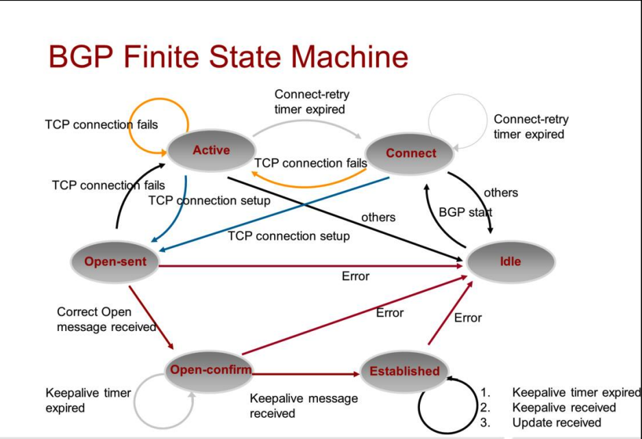

### BGP Connection States

#### 1. **Idle**
This is the first state of the BGP connection in which BGP is waiting for a start event. Examples of start events are establishing a BGP session through router configuration or resetting an already existing session. After the Start event, BGP:
- Initializes its resources
- Resets a ConnectRetry timer
- Initiates a TCP connection
- Starts listening for a connection that may be initiated by a remote peer.

BGP then transitions to the **Connect** state. In case of errors, BGP falls back to the **Idle** state.

#### 2. **Connect**
In this state, BGP establishes the first TCP connection. 
- If the TCP connection is successful, the state transitions to **OpenSent** (this is where the OPEN message is sent).
- If the connection fails, the state transitions to **Active**.
- If the ConnectRetry timer expires, the state remains in the Connect stage, the timer is reset, and a TCP connection is initiated again.

#### 3. **Active**
In this state, BGP always attempts to establish the TCP connection.
- If the ConnectRetry timer expires, it will return to the **Connect** state.
- Otherwise, it will enter the **OpenSent** state.
- If the TCP connection fails, it will remain in the Active state and keep initiating the TCP connection.
- Additionally, BGP continues to listen for a connection that might be initiated by another peer.

The state may return to **Idle** in case of other events, such as a Stop event initiated by the system or the operator.

#### 4. **OpenSent**
In this state, the BGP connection has been established.
- The **OPEN** message has been sent, and BGP is waiting to hear an **OPEN** message from its neighbor.
- The OPEN message is checked for correctness. If errors are found, such as a bad version number or an unacceptable AS, the system sends an error **NOTIFICATION** message and goes back to **Idle**.
- If no errors are found, BGP starts sending **KEEPALIVE** messages and resets the KEEPALIVE timer. Meanwhile, it will enter the **OpenConfirm** state.

#### 5. **OpenConfirm**
In this state, the BGP process waits for a **Keepalive** or **Notification** message.
- If a **Keepalive** is received, the state transitions to **Established**.
- If a **Notification** is received, or a **TCP disconnect** is received, the state transitions to **Idle**.
- If the **Hold timer** expires, an error is detected, or a **Stop** event occurs, a **Notification** is sent to the neighbor, and the BGP connection is closed, changing the state to **Idle**.

#### 6. **Established**
This is the final stage in the neighbor negotiation.
- At this stage, BGP starts exchanging **UPDATE** packets with its peers.
- The **Hold Timer** restarts at the receipt of an **UPDATE** or **KEEPALIVE** message.
- If the system receives any **NOTIFICATION** message (if an error has occurred), the state falls back to **Idle**.
- The **UPDATE** messages are checked for errors, such as missing attributes, duplicate attributes, and so on. If errors are found, a **NOTIFICATION** message is sent to the peer, and the state falls back to **Idle**.
- If the **Hold Timer** expires, or a **disconnect** notification is received from the transport protocol, or a **Stop** event occurs, the system falls back to the **Idle** state.

### **Using `display bgp peer` Command**
By using the `display bgp peer` command, we always observe these two states:
- **Active**: Indicates that the TCP connection failed to establish. This could be due to the inability of a neighbor to reach the IP address of its peer or mistakes in the configuration. As a result, the neighbors are not able to exchange routing information.
- **Established**: Indicates that the BGP session has been successfully established, and routing information is exchanged.
