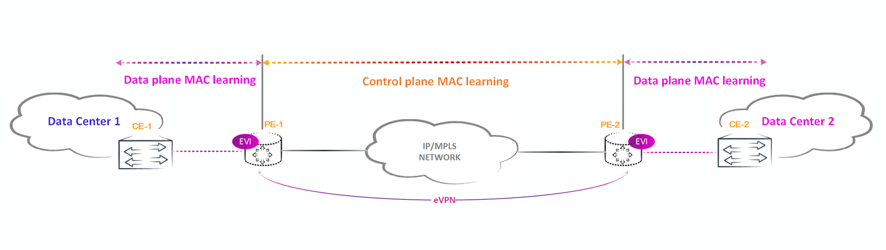

EVPN использует для сигнализации исключительно протокол BGP, но использует уже новые NLRI: AFI 25 SAFI 70 (некоторые версии Wireshark еще не знают данное AFI/SAFI и при снятии дампа пишут unknown SAFI for AFI 25). Использование нового семейства адресов обусловлено тем, что EVPN использует для изучения MAC-адресов не только data-plane, как в стандартном VPLS или коммутаторе, но и control-plane

В EVPN существует всего 5 типов маршрутов:

1 — Ethernet Auto-Discovery (A-D) route
Используется для автоматического обнаружения соседей (PE-маршрутизаторов) и их возможностей. Этот маршрут помогает маршрутизаторам узнать, какие другие устройства (маршрутизаторы) могут быть частью EVPN-сети

2 — MAC/IP Advertisement route
Распространяет информацию о MAC-адресах и IP-адресах в сети. Это позволяет PE-маршрутизаторам узнавать, где находятся устройства и как они могут быть достигнуты.

3 — Inclusive Multicast Ethernet Tag route
Данный маршрут генерируется каждым PE маршрутизатором и используется для приема и отправки BUM трафика

4 — Ethernet Segment route
Применяется для мультихомедных (multi-homed) сайтов. Это позволяет обеспечить отказоустойчивость и балансировку нагрузки при подключении одного устройства к нескольким PE-маршрутизаторам

5 — IP Prefix Route*
Объявляет IP-префиксы для маршрутизации IP-трафика в EVPN. Это позволяет интегрировать L3-функции (маршрутизация) в EVPN-сеть, используя стандартные IP-адреса.

Ассиметричная схема - все irb есть на всех РЕ. Будут EVPN\7 маршруты и форвардинг без Л3ВПН  
Симметричная схема - irb на РЕ отсутствует. Будет форвардинг через Л3ВПН

per-EVI — этот маршрут сгенерирован определенным инстансом

per-ESI — этот маршрут сгенерирован не каким-то определенным инстансом, а маршрутизатором для всех инсатнсов имеющих линк в данном ESI. Один и тот же сегмент может быть включен в несколько evpn инстанций (к примеру в инстанс EVPN1 добавлен интерфейс ae3.777, а в EVPN2 — ae3.778, хоть это и разные юниты, но ESI конфигурится на весь интерфейс целиком, а значит у данных интерфейсов будет один и тот же ESI, хоть и находятся они в разных EVI).

