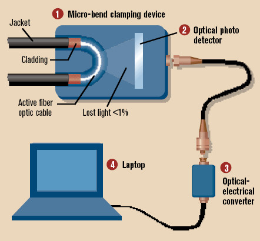
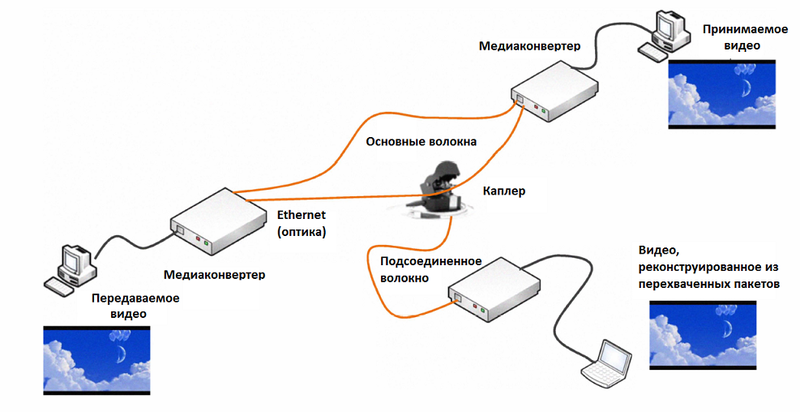

Волокно чуть изгибают — на месте сильного изгиба часть света выходит из сердцевины в оболочку и наружу (это явление называется микроизгибные потери).

Часть этого излучения улавливают специальным фотоприёмником.

Сигнал очень слабый, но с помощью усилителей и оборудования его можно восстановить.