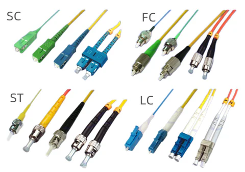

# Оптика
## Оптическое затухание: источники и типовые значения

##  Что такое затухание?

**Затухание** — это потеря мощности сигнала при прохождении через оптическую линию.  
Измеряется в **дБ (децибелах)**. Чем выше затухание, тем слабее сигнал на приёмнике.

---

##  Основные источники затухания

### 1.  Оптоволокно
Даже чистое волокно даёт потери, особенно на длинных участках.

| Тип волокна      | Затухание     | Примерная потеря |
| ---------------- | ------------- | ---------------- |
| SM (Single-mode) | 0.2–0.4 dB/км | 20 км → 4–8 dB   |
| MM (Multimode)   | 1.5–3.0 dB/км | 1 км → 1.5–3 dB  |

>  SM используется на дальние расстояния — у него ниже затухание.

---

### 2. Коннекторы (LC, SC и др.)

| Элемент             | Типичная потеря |
| ------------------- | --------------- |
| Чистый LC/SC        | 0.2–0.5 dB      |
| Загрязнённый разъём | до 1 dB и выше  |

>  Чистка разъёмов — критична. Даже пылинка = ошибка.

---

### 3.  Сварки (сплайсы)

| Тип соединения          | Потери      |
| ----------------------- | ----------- |
| Хорошая сварка волокон  | 0.05–0.2 dB |
| Механическое соединение | до 0.5 dB   |

---

### 4.  Сплиттеры (разветвители)

| Сплиттер | Потери   |
| -------- | -------- |
| 1:2      | ~3.5 dB  |
| 1:4      | ~7 dB    |
| 1:8      | ~10.5 dB |
| 1:16     | ~13.5 dB |

> ⚠️ Сплиттеры — самые "прожорливые" элементы по затуханию.

---

### 5.  Перегибы кабеля

| Ситуация                 | Потери    |
| ------------------------ | --------- |
| Перегиб с малым радиусом | до 3–5 dB |
| Кабель зажат или пережат | 1–3 dB    |

> 📛 Изгиб кабеля — скрытая причина потерь!

---

##  Пример расчёта затухания линии (SM, 10 км):

- Волокно: 10 км × 0.3 dB = **3.0 dB**
- Коннекторы: 2 × 0.3 dB = **0.6 dB**
- Сварки: 2 × 0.1 dB = **0.2 dB**

**Итого:** ~**3.8–4.0 dB** общих потерь

Если передатчик (TX Power) = `0 dBm`, то приёмник получит ≈ `-4 dBm`,  
что **в пределах нормы** для большинства модулей с RX Sensitivity до `-18 dBm`.

---

##  Сводная таблица типичных потерь

| Источник          | Потери        |
| ----------------- | ------------- |
| Волокно (SM)      | 0.2–0.4 dB/км |
| Коннектор (LC/SC) | 0.2–0.5 dB    |
| Сварка            | 0.05–0.2 dB   |
| Сплиттер 1:8      | ~10.5 dB      |
| Перегиб кабеля    | до 5 dB       |

---

>  *Затухание = сумма всех потерь в линии → обязательно учитывай при проектировании или диагностике!*

# Разьёмы

#  Оптические разъёмы: типы, особенности и применение

Оптические разъёмы — это соединители, которые обеспечивают выравнивание и контакт оптоволокон для передачи света между модулями, кабелями и патч-панелями.

---

##  Основные типы разъёмов

| Разъём      | Название             | Особенности                               | Где используется                       |
| ----------- | -------------------- | ----------------------------------------- | -------------------------------------- |
| **SC**      | Subscriber Connector | Крупный, квадратный, защёлка              | Стойки, патч-панели, устаревшие сети   |
| **LC**      | Lucent Connector     | Маленький, компактный, популярный         | Наиболее часто в 1G/10G/100G           |
| **ST**      | Straight Tip         | Круглый, байонетный, закручивается        | Старое оборудование, редко             |
| **FC**      | Ferrule Connector    | Резьбовое соединение, надёжно фиксируется | Виброустойчивые или лабораторные среды |
| **MPO/MTP** | Multi-fiber Push-On  | Плоский, сразу много волокон (12, 24…)    | Дата-центры, 40G/100G/400G Ethernet    |
| **E2000**   | —                    | С крышкой, надёжный, пылезащитный         | Энергетика, спецобъекты, транспорт     |

---

##  Быстрые визуальные ассоциации

- **SC** — квадратный, крупный, "щёлкается"
- **LC** — миниатюрный, как половинка SC
- **ST** — круглый, вставляется и поворачивается
- **FC** — круглый с резьбой
- **MPO/MTP** — плоский, широкий, многожильный

---

##  Комбинации в патч-кордах

- `LC–LC` — стандарт для SFP/SFP+/XFP
- `SC–LC` — когда старое оборудование (SC) соединяют с новым (LC)
- `MPO–LC Fanout` — когда один многожильный коннектор распадается на 4×LC (напр. 40G → 4×10G)

---

##  О ферулах

- Внутри каждого разъёма — **ферула** (керамическая трубка с волокном)
- Диаметр ферулы:
  - SC, FC, ST: **2.5 мм**
  - LC: **1.25 мм**
- Чем точнее и чище ферула, тем меньше потери сигнала

---

##  Таблица сравнения

| Разъём  | Диаметр ферулы | Тип соединения | Распространённость        |
| ------- | -------------- | -------------- | ------------------------- |
| SC      | 2.5 мм         | Защёлка        | Средняя, устаревающая     |
| LC      | 1.25 мм        | Защёлка        | Очень высокая             |
| ST      | 2.5 мм         | Байонет        | Низкая, устаревшая        |
| FC      | 2.5 мм         | Резьба         | Спец. задачи, лаборатории |
| MPO/MTP | —              | Защёлка        | Дата-центры, 40G+/400G    |

---

##  Чистка и обслуживание

- Любой разъём требует **регулярной чистки**!
- Даже микроскопическая пыль может дать **1–3 dB** потерь.
- Используют специальные палочки, кассеты или спиртовые салфетки.

> Оптические соединения — не просто "вставил и забыл". Их нужно **поддерживать в чистоте**.

---

#  Типы оптических волокон: Single-mode vs Multimode

Оптоволокно — это сердечник из стекла или пластика, по которому передаётся световой сигнал. Волокна бывают разные, и важно знать отличия, чтобы правильно выбирать оборудование и кабели.

---

## 1.  Single-mode (SM) — одномодовое волокно

### Основные характеристики:
- **Диаметр сердечника:** около 8–10 микрон (очень тонкое!)
- **Передача света:** только один луч (мод)
- **Дальность:** очень большая, десятки и сотни километров
- **Затухание:** очень низкое (~0.2 дБ/км)
- **Источник света:** лазер (обычно)
- **Цвет оболочки:** жёлтый

### Где используется?
- Междугородние линии, магистральные сети
- Дата-центры с длинными каналами
- Высокоскоростные сети (10G, 40G, 100G и выше)

### Преимущества:
- Минимальные потери и искажения на больших расстояниях
- Высокая скорость передачи данных

---

## 2.  Multimode (MM) — многомодовое волокно

### Основные характеристики:
- **Диаметр сердечника:** 50 или 62,5 микрон (гораздо шире)
- **Передача света:** множество лучей (модов) одновременно
- **Дальность:** меньше, обычно до 550 м (зависит от типа)
- **Затухание:** выше, около 1–3 дБ/км
- **Источник света:** светодиод (LED) или VCSEL
- **Цвет оболочки:** обычно оранжевый (OM1/OM2) или aqua/голубой (OM3/OM4)

### Где используется?
- Локальные сети (LAN)
- Внутридомовые подключения, кампусы
- Короткие линии с высокими скоростями (10G/25G до 300 м)

### Преимущества:
- Дешевле, проще в монтаже
- Не требует лазеров, работают с дешевым оборудованием

---

## 3.  Классификация Multimode по стандартам OMx

| Тип | Сердечник (микрон) | Скорость и расстояние (пример) | Цвет оболочки  |
| --- | ------------------ | ------------------------------ | -------------- |
| OM1 | 62.5               | 1G до 275 м                    | Оранжевый      |
| OM2 | 50                 | 1G до 550 м                    | Оранжевый      |
| OM3 | 50 (лазерный)      | 10G до 300 м                   | Aqua (голубой) |
| OM4 | 50 (лазерный)      | 10G до 400 м, 40/100G до 150 м | Aqua (голубой) |

---

## 4. Ключевые отличия SM и MM

| Параметр           | Single-mode (SM)      | Multimode (MM)             |
| ------------------ | --------------------- | -------------------------- |
| Сердечник (мкм)    | ~9                    | 50 или 62,5                |
| Источник света     | Лазер                 | LED или VCSEL              |
| Максимальная длина | > 10 км (до сотен км) | До ~550 м                  |
| Затухание (дБ/км)  | 0.2                   | 1–3                        |
| Применение         | Магистраль, межгород  | Локальные сети             |
| Цвет оболочки      | Жёлтый                | Оранжевый / Голубой (OM3+) |

---

## 5.  Важное правило совместимости

- **SM и MM нельзя смешивать!**  
- Подключение SM-модуля к MM-кабелю (или наоборот) приведёт к плохому сигналу или его отсутствию.
- Цвет оболочки и маркировка помогают избежать ошибок.

---

## 6.  Выбор волокна зависит от задачи:

- Для длинных линий и высоких скоростей — SM.
- Для коротких локальных сетей, где важна стоимость — MM.
- Для новых проектов в дата-центрах — чаще SM, но MM OM3/OM4 тоже популярны.

---

> **Итог:** выбирая кабель и оборудование, всегда проверяй тип волокна и совместимость, чтобы обеспечить надёжную и качественную передачу данных.

