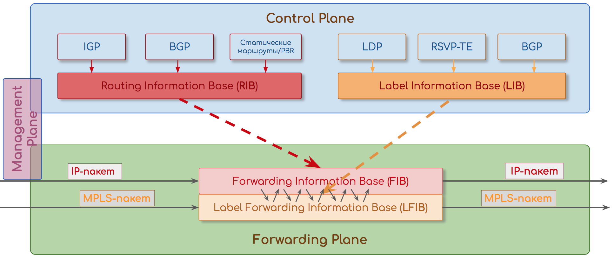
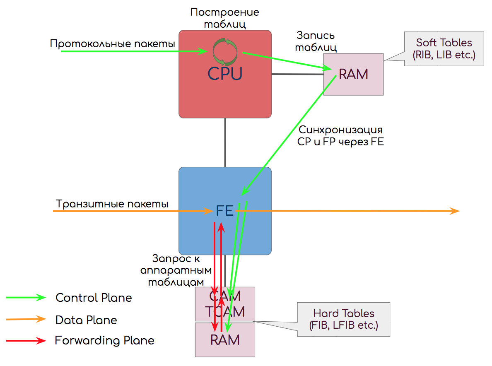
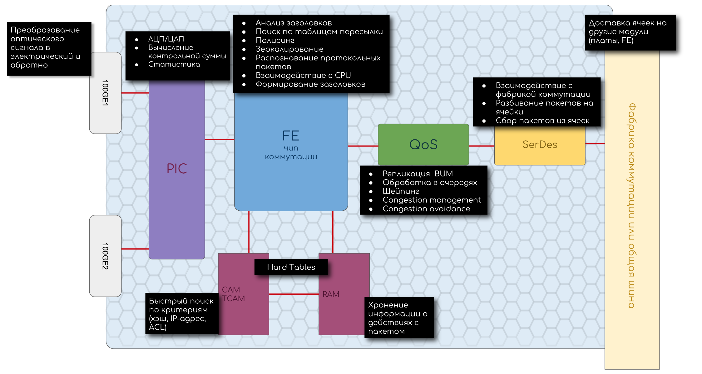

Forwarding Plane — передача трафика на основе таблиц пересылок — собственно то, из чего оператор извлекает прибыль.

Control Plane — служебный уровень, необходимый для формирования условий для работы Forwarding Plane.

Management Plane — модуль, следящий за общим состоянием устройства.

Control Plane обычно реализован на связке CPU+RAM+карта памяти, а Forwarding Plane на ASIC, FPGA, CAM, TCAM.

