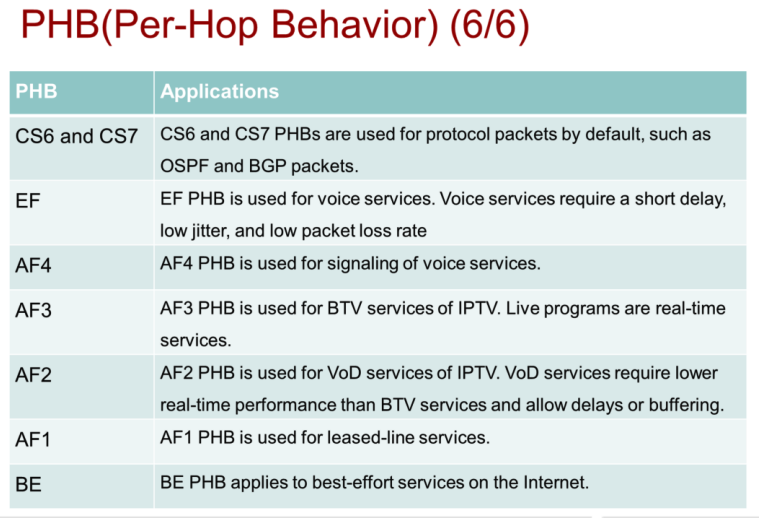

**Классификация**: процесс классификации включает просмотр различных полей в заголовке Ethernet L2, а также полей IP-заголовка (уровень 3 - L3) и заголовков TCP/UDP (уровень 4 - L4), чтобы обеспечить определенный уровень услуг при коммутации пакетов.

**Политика**: осуществление политики является процессом анализа кадра Ethernet, чтобы определить, не будет ли превышен заданный уровень трафика за определенный интервал времени (обычно, это время является внутренним параметром переключателя). Если кадр создает ситуацию, при которой трафик превысит заданный уровень, он будет отброшен. Или значение CoS (Class of Service) может быть понижено.

Для входящего best-effort трафика:

Dedicated buffers
Shared buffers
Для входящего lossless трафика:

Dedicated buffers
Shared buffers
Lossless headroom buffers
Для всего исходящего трафика:

Dedicated buffers
Shared buffers

PHB (Per-Hop Behavior)
PHB — это поведение на каждом узле сети (например, на маршрутизаторе или коммутаторе). Оно определяет, как устройство будет обрабатывать пакеты:

AF (Assured Forwarding): Гарантированная передача, но с разными уровнями приоритета (например, AF1, AF2, AF4).

BE (Best Effort): Обычный трафик без гарантий.

EF (Expedited Forwarding): Трафик с высшим приоритетом (например, для VoIP).

CS (Class Selector): Трафик с фиксированным приоритетом (например, CS6 — для критически важных данных).

Цвета (Green, Yellow, Red)
Цвета используются для управления перегрузкой:

Зелёный (Green): Трафик в пределах нормы, обрабатывается в приоритетном порядке.

Жёлтый (Yellow): Трафик близок к превышению лимита, может быть отброшен, если сеть перегружена.

Красный (Red): Трафик превышает лимит, обычно отбрасывается.

Цвета помогают решить, какие пакеты можно отбросить, если сеть перегружена.

WRED (Weighted Random Early Detection)
WRED — это механизм для управления перегрузкой. Он случайным образом отбрасывает пакеты, чтобы избежать переполнения очередей.

Weighted (взвешенный): Пакеты с более низким приоритетом (например, жёлтые или красные) отбрасываются с большей вероятностью.

Random (случайный): Отбрасывание происходит случайно, чтобы избежать "эффекта синхронизации" (когда все отправители одновременно снижают скорость).

Early Detection (раннее обнаружение): WRED начинает отбрасывать пакеты до того, как очередь полностью заполнится.

Итог:
PHB — это правила, как обрабатывать трафик.

Цвета — это индикаторы, какие пакеты можно отбросить при перегрузке.

WRED — это механизм, который помогает избежать перегрузки, случайно отбрасывая пакеты.

DSCP (Differentiated Services Code Point) — это 6 бит в IP-пакете, которые используются для определения приоритета трафика.

IP Precedence — это устаревший метод, который использует только первые 3 бита из этих 6.

Если устройство понимает только IP Precedence, то оно смотрит только на первые 3 бита DSCP, а последние 3 бита игнорирует.

Например:

DSCP 010000 (первые 3 бита: 010)

DSCP 010011 (первые 3 бита: 010)

Для устройства, которое понимает только IP Precedence, эти два значения равнозначны, потому что первые 3 бита одинаковые (010).

Итог:

Одно значение IP Precedence (3 бита) может соответствовать 8 значениям DSCP (6 бит), потому что последние 3 бита DSCP игнорируются.

Проще говоря: если устройство старое и понимает только IP Precedence, то ему всё равно, какие последние 3 бита в DSCP — оно смотрит только на первые 3.

