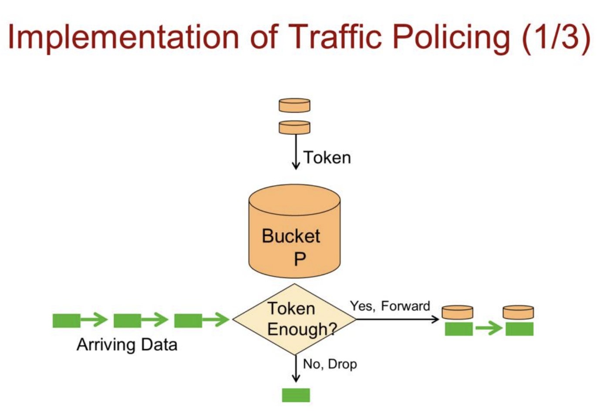
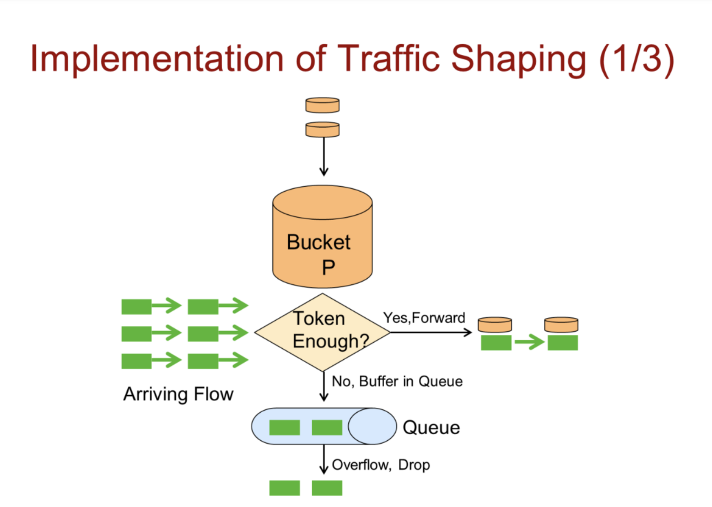
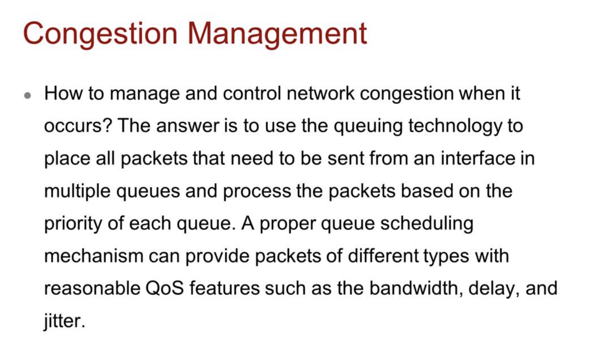
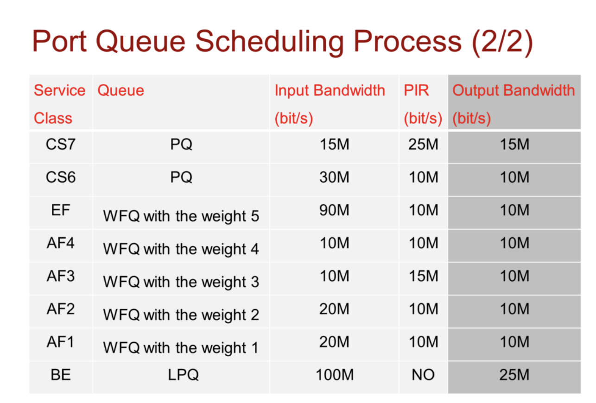

The main differences between traffic shaping and traffic policing are as follows:
 Traffic policing drops or re-marks the priority of packets that exceed the traffic
specification on the interface. Traffic shaping buffers packets that exceed the
traffic specification on the interface.
 Traffic shaping increases the delay and traffic policing does not

GTS — это расширение возможностей traffic shaping, позволяющее работать с более сложными и нерегулярными потоками трафика, улучшая управление ресурсами и предотвращая перегрузки в сети.

 GTS can shape a specified packet flow or all packets on the interface. 

